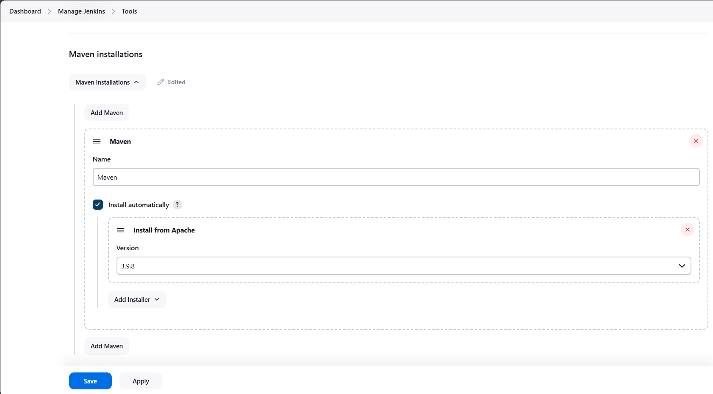
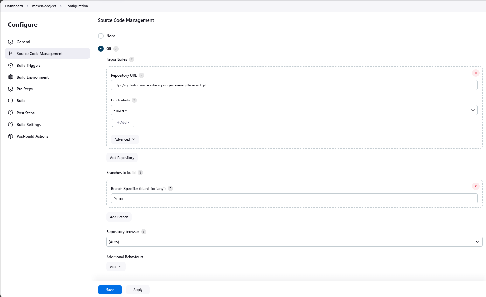
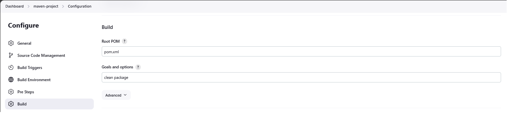
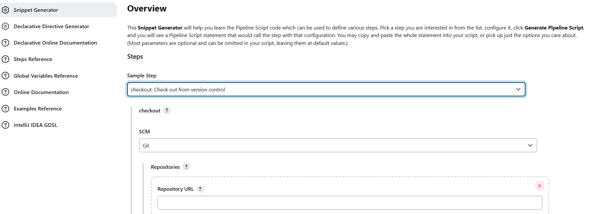

# springboot-rest-sample

## Introduction
This is a Spring rest project for gitlab CI/CD pipeline using local runner

## GitLab
* [.gitlab-ci-localrunner.yml](src%2Fmain%2Fresources%2Fgitlab%2F.gitlab-ci-localrunner.yml)
* [.gitlab-ci-DinD.yml](src%2Fmain%2Fresources%2Fgitlab%2F.gitlab-ci-DinD.yml)

## Jenkins
### GitHub + Maven Project

##### plugins:
following plugin should be installed in jenkins
* Maven Integration plugin 

##### tools

* Set Maven Location in Global Tool Configuration (Manage Jenkins --> Tools --> Install Maven)

#### Jenkins Maven Project Setup

### GitHub and Maven Pipeline Project

[Jenkinsfile](src%2Fmain%2Fresources%2Fjenkins%2FJenkinsfile)

use "Pipeline Syntax" to generate checkout from your reposiory

### GitHub, Maven, and Docker Pipeline Project

Docker should be up and running locally along with Jenkins

##### plugins:
following plugin should be installed in jenkins
* Maven Integration plugin
* Pipeline Maven Integration plugin
* Pipeline Utility Steps

##### pipeline configuration
General
1. GitHub project
   * provide github project url
2. Build Triggers
   * Build whenever a SNAPSHOT dependency is built
   * GitHub hook trigger for GITScm polling
